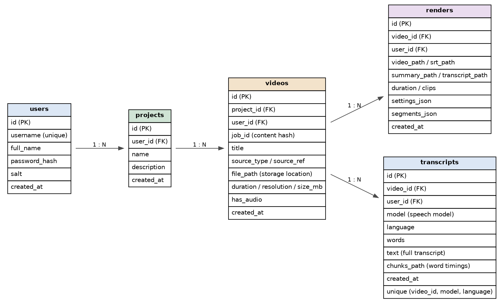

# 🎬 Video Summarizer

A local web application for turning long videos into searchable transcripts and concise, time-aligned summary videos.

The application provides a project-based media library, speech transcription with Whisper, extractive summarization with BERT embeddings, timestamp-aware segment selection, and FFmpeg-based summary-video rendering.

---

## ✨ Features

### 📁 Project management
- Create projects with a name and description.
- Search projects by name or description.
- Open and delete projects.
- View project-level video and summary counts.
- Project ownership is associated with the signed-in user.

### 🎥 Video library
- Add videos by uploading a local video file.
- Download videos from YouTube/direct video links.
- Optionally provide a custom video name.
- Rename stored videos later.
- Search videos by title or source.
- Re-open previously stored videos without uploading them again.
- Play the selected source video directly from the project library.

### 🎙️ Transcription
- Extract audio with FFmpeg.
- Generate word-level timestamps using Whisper.
- Apple Silicon uses the MLX Whisper repositories defined by the application.
- Other systems use the corresponding Hugging Face Whisper repositories.
- Supported UI languages include English, Auto-detect, Hindi, Kannada, Tamil, Telugu, Marathi, Spanish, French, and German.
- Transcripts are cached per video, speech model and language.

### 📝 Extractive summarization
- Uses `bert-extractive-summarizer`.
- Uses BERT embeddings with k-means based sentence selection.
- Supports **Short**, **Balanced**, **Detailed**, and **Extended** presets.
- Choose summary size by percentage of candidate sentences or exact sentence count.
- Advanced controls include sentence-length filtering, timestamp padding, clip merging, first-sentence inclusion, and embedding-model selection.
- Selected sentences are mapped back to timestamps in the original video.
- Preview includes summary text, selected segment thumbnails, timestamps, clip duration, and keep/remove controls.

### 🎞️ Summary-video rendering
- Cuts the selected source ranges into clips.
- Joins the selected clips into one summary video.
- Generates subtitles.
- Generates summary and transcript text files.
- Stores every render in the video's history.
- Previously generated renders can be played again and their generated files can be accessed.

### 💾 Persistent library
The database stores projects, videos, transcripts, summaries and rendered outputs so previously created work can be restored after restarting the application.

---

## 🏗️ Application workflow

```text
                    ┌──────────────────┐
                    │      Projects    │
                    │  Create / Search │
                    │   Open / Delete  │
                    └────────┬─────────┘
                             │
                             ▼
                    ┌──────────────────┐
                    │      Videos      │
                    │ Upload / Download│
                    │ Search / Play    │
                    │ Rename / Open    │
                    └────────┬─────────┘
                             │
                             ▼
                    ┌──────────────────┐
                    │    Summarise     │
                    │                  │
                    │ 1. Transcribe    │
                    │ 2. Summarize     │
                    │ 3. Render        │
                    └────────┬─────────┘
                             │
                             ▼
                ┌──────────────────────────┐
                │   Summary Video + Files  │
                │ MP4 / SRT / TXT / TXT   │
                └──────────────────────────┘
```

The three main screens are implemented in `app.py`: **Projects → Videos → Summarise**.

---

## 🧠 Processing pipeline

The backend in `pipeline.py` is organized into four stages:

```text
Video source
    │
    ▼
┌─────────────────────┐
│ 1. Source           │
│ Upload / download   │
│ Probe video         │
└──────────┬──────────┘
           │
           ▼
┌─────────────────────┐
│ 2. Transcript       │
│ FFmpeg audio        │
│ Whisper             │
│ Word timestamps     │
│ Cached              │
└──────────┬──────────┘
           │
           ▼
┌─────────────────────┐
│ 3. Summary          │
│ Sentence extraction │
│ BERT embeddings     │
│ K-means selection   │
│ Timestamp mapping   │
│ Thumbnails          │
└──────────┬──────────┘
           │
           ▼
┌─────────────────────┐
│ 4. Video            │
│ Cut clips           │
│ Join clips          │
│ Add subtitles       │
│ Export files        │
└─────────────────────┘
```

The pipeline uses FFmpeg for audio/video operations and supports progress callbacks for long-running operations.

---

## 🗂️ Project structure

```text
video_summarizer_app/
│
├── app.py                 # Gradio UI and application workflow
├── db.py                  # SQLite persistence and account management
├── pipeline.py            # Video, Whisper, summarization and rendering logic
├── requirements.txt       # Python dependencies
├── build.sh               # Environment setup / run commands
├── .gitignore             # Git exclusions
├── README.md              # Project documentation
├── er_diagram.png         # Database ER diagram
│
└── workspace/             # Runtime data (ignored by Git)
    ├── app.db             # SQLite database
    ├── downloads/         # Videos downloaded from links
    └── jobs/
        └── <content-hash>/
            ├── source.*             # Stored source video
            ├── meta.json            # Stored video metadata/title
            ├── transcript_*.json    # Cached transcript + timestamps
            ├── thumbs/               # Preview thumbnails
            └── renders/
                └── <timestamp>/
                    ├── clips/
                    ├── summary video
                    ├── subtitles
                    ├── summary text
                    └── transcript text
```

> `workspace/` contains local application data and is intentionally excluded from Git.

---

## 🗄️ Database

The application uses SQLite at:

```text
workspace/app.db
```

The current database schema contains **five tables**:

```text
users
  │
  └── 1:N ── projects
               │
               └── 1:N ── videos
                            │
                            ├── 1:N ── transcripts
                            │
                            ├── 1:N ── summaries
                            │
                            └── 1:N ── renders
```

### `users`

Stores application accounts.

| Column | Purpose |
|---|---|
| `id` | Primary key |
| `username` | Unique username |
| `full_name` | Display/full name |
| `password_hash` | PBKDF2-SHA256 password hash |
| `salt` | Password salt |
| `created_at` | Account creation time |

### `projects`

Stores user-owned collections of videos.

| Column | Purpose |
|---|---|
| `id` | Primary key |
| `user_id` | Project owner |
| `name` | Project name |
| `description` | Optional description |
| `created_at` | Creation time |

### `videos`

Stores every video associated with a project.

| Column | Purpose |
|---|---|
| `id` | Primary key |
| `project_id` | Parent project |
| `user_id` | User owner |
| `job_id` | Content fingerprint used by the pipeline |
| `title` | Video title |
| `source_type` | `upload` or `link` |
| `source_ref` | Original file name or URL |
| `file_path` | Stored video location |
| `duration` | Video duration |
| `resolution` | Video resolution |
| `size_mb` | Stored file size |
| `has_audio` | Whether an audio stream exists |
| `created_at` | Added time |

### `transcripts`

Stores the generated transcript for a video, speech model and language combination.

| Column | Purpose |
|---|---|
| `id` | Primary key |
| `video_id` | Parent video |
| `user_id` | User owner |
| `model` | Speech model |
| `language` | Language code |
| `words` | Word count |
| `text` | Full transcript |
| `chunks_path` | Word-timestamp JSON path |
| `created_at` | Creation/update time |

The database enforces uniqueness for:

```text
(video_id, model, language)
```

### `summaries`

Stores generated summary previews and their configuration.

| Column | Purpose |
|---|---|
| `id` | Primary key |
| `video_id` | Parent video |
| `user_id` | User owner |
| `summary_text` | Generated summary |
| `stats_json` | Summary statistics |
| `settings_json` | Summary settings |
| `segments_json` | Selected timestamped segments |
| `keep_json` | Keep/remove flags |
| `created_at` | Creation time |

### `renders`

Stores every rendered summary-video version.

| Column | Purpose |
|---|---|
| `id` | Primary key |
| `video_id` | Parent video |
| `user_id` | User owner |
| `video_path` | Summary video path |
| `srt_path` | Subtitle file path |
| `summary_path` | Summary text path |
| `transcript_path` | Transcript text path |
| `duration` | Summary duration |
| `clips` | Number of clips |
| `settings_json` | Settings used for the render |
| `segments_json` | Exact rendered segments |
| `created_at` | Render creation time |

### ER diagram

Place the supplied ER diagram in the repository as:

```text
er_diagram.png
```



> **Schema note:** the supplied diagram illustrates `users → projects → videos → renders/transcripts`. The current `db.py` also contains a `summaries` table used to persist generated summary previews and segment selections, so the diagram should be updated when the schema documentation is refreshed.

---

## 🔐 Authentication

Accounts are stored locally in SQLite.

Passwords are not stored as clear text. The database layer uses PBKDF2-HMAC-SHA256 with 200,000 iterations and a random salt.

Create an account:

```bash
python3.14 db.py add-user <username>
```

The command prompts for the password and optional full name.

List users:

```bash
python3.14 db.py list-users
```

Reset a password:

```bash
python3.14 db.py reset-password <username>
```

---

## ⚙️ Requirements

The project currently declares:

```text
gradio>=6
transformers>=5
torch
bert-extractive-summarizer
imageio-ffmpeg
numpy
pandas
yt-dlp[default]
mlx-whisper      # Apple Silicon only
```

The exact dependency specification is in [`requirements.txt`](requirements.txt).

---

## 🚀 Installation

### 1. Clone the project

```bash
git clone <your-repository-url>
cd video_summarizer_app
```

### 2. Create a virtual environment

The supplied build script uses Python 3.14:

```bash
python3.14 -m venv venv_project
source venv_project/bin/activate
```

### 3. Install dependencies

```bash
pip install -r requirements.txt
```

### 4. Optional: install Deno for YouTube links

The application attempts to locate a JavaScript runtime for YouTube downloads. The supplied setup uses:

```bash
brew install deno
```

### 5. Create your first account

```bash
python3.14 db.py add-user adminuser
```

### 6. Start the application

```bash
python3.14 app.py
```

Open:

```text
http://127.0.0.1:7860
```

Sign in with the account created above.

The application is configured as a local single-machine web application.

---

## 🖥️ Using the application

### Step 1 — Projects

From the **Projects** screen:

1. Search existing projects.
2. Select a project row.
3. Open the selected project.
4. Create a new project from the project form.
5. Delete a project after confirming the deletion.

Project data is loaded from SQLite rather than being maintained only in the browser session.

### Step 2 — Videos

Inside a project:

1. Search stored videos.
2. Upload a video file or paste a video link.
3. Optionally set a custom video name.
4. Play the selected stored video.
5. Rename or remove a video.
6. Open the selected video to start summarization.

Stored videos use a content fingerprint, allowing the pipeline to reuse an already stored source file when the same content is encountered again.

### Step 3 — Summarise

The summarization screen is divided into three processing steps.

#### 1. Transcribe

Choose:

- Whisper speech model
- language

Then select **Extract audio & transcribe**.

The transcript is cached and stored in the database.

#### 2. Tune the summary

Choose a preset or manually configure:

- summary percentage or exact sentence count
- minimum sentence length
- maximum sentence length
- timestamp padding
- clip merge gap
- first-sentence inclusion
- embedding model

Use **Preview summary** to generate timestamped candidate clips.

You can untick individual segments before rendering.

#### 3. Create the summary video

Select **Confirm & create video**.

The renderer creates:

```text
MP4 summary video
SRT subtitles
summary TXT
transcript TXT
```

The render record is stored in SQLite and appears under **Earlier summary videos**.

---

## ♻️ Persistence and reopening

The application separates persistent data from temporary in-memory pipeline state.

### Persistent

Stored in `workspace/app.db` and the workspace filesystem:

- users
- projects
- videos
- transcripts
- summary previews
- segment selections
- render history
- generated video/file paths
- cached transcript files
- thumbnails

### Runtime

The processing pipeline maintains `Job` objects in memory while the application is running. When an existing video is reopened, the application reconstructs the job from the stored source video and restores persisted transcript, summary, and render information where available.

This allows previously created project and video data to remain available after an application restart.

---

## ⚡ Caching and performance

The application uses several caching mechanisms.

### Video-level fingerprinting

The pipeline creates a content fingerprint using the file size plus data from the beginning and end of the file.

### Transcript cache

Whisper output is cached per video, speech model and language.

```text
video
  └── transcript_<model/language>.json
```

### Embedding cache

Sentence embeddings are cached for combinations of:

```text
(model, min_chars, max_chars)
```

Changing summary-selection settings can therefore avoid recomputing the same sentence embeddings.

### Parallel rendering

Multiple selected clips can be cut concurrently before the final output is assembled.

---

## 🔍 Useful SQLite queries

Inspect projects, videos and render counts:

```bash
sqlite3 workspace/app.db "
SELECT
    p.name,
    v.title,
    v.file_path,
    COUNT(r.id) AS summaries
FROM projects p
JOIN videos v
    ON v.project_id = p.id
LEFT JOIN renders r
    ON r.video_id = v.id
GROUP BY v.id;
"
```

Inspect transcripts:

```bash
sqlite3 workspace/app.db "
SELECT
    v.title,
    t.model,
    t.language,
    t.words,
    substr(t.text, 1, 80)
FROM transcripts t
JOIN videos v
    ON v.id = t.video_id;
"
```

Inspect generated summary previews:

```bash
sqlite3 workspace/app.db "
SELECT
    v.title,
    s.created_at,
    s.summary_text
FROM summaries s
JOIN videos v
    ON v.id = s.video_id
ORDER BY s.created_at DESC;
"
```

Inspect render history:

```bash
sqlite3 workspace/app.db "
SELECT
    v.title,
    r.created_at,
    r.duration,
    r.clips,
    r.video_path
FROM renders r
JOIN videos v
    ON v.id = r.video_id
ORDER BY r.created_at DESC;
"
```

---

## 🧹 Runtime data and cleanup

All runtime data is stored under:

```text
workspace/
```

Deleting a project or video removes database records, while the stored files on disk are intentionally left in place by the current database layer.

To remove the complete local workspace, including accounts and generated data:

```bash
rm -rf workspace/
```

Use that command only when you intentionally want to reset the local application data.

---

## 🔧 Configuration

The workspace location can be changed with:

```bash
export VIDEOSUM_WORKSPACE=/path/to/workspace
```

The application and pipeline both use this environment variable.

If it is not set, the default is:

```text
workspace/
```

---

## 📦 Git repository

Recommended repository contents:

```text
.gitignore
README.md
app.py
db.py
pipeline.py
requirements.txt
build.sh
er_diagram.png
```

Local runtime content should remain outside version control:

```text
workspace/
venv_project/
.venv/
.env
*.db
*.sqlite
*.mp4
*.mov
*.mkv
*.srt
```

See [`.gitignore`](.gitignore).

---

## 🔧 Development notes

The project is intentionally organized into three layers:

```text
app.py
  └── UI, user actions, state and persistence orchestration

db.py
  └── SQLite schema and CRUD operations

pipeline.py
  └── FFmpeg, Whisper, summarization and rendering
```

This separation allows the UI to change without moving the video-processing implementation into the database layer.

---

## 📌 Current limitations

The current application is designed for a **single-machine local deployment**.

The existing implementation does not provide:

- HTTPS
- application-level rate limiting
- a web-based password-reset workflow
- distributed/background worker infrastructure
- multi-machine shared storage

The YouTube workflow should only be used for videos that the user has the right to download and process.

---

## 📄 License

Add your preferred license before publishing the repository publicly. For example:

```text
MIT License
```

No license file is currently declared by the supplied project files.

---

## 👨‍💻 Author

**Vedant Desai**

Video Summarizer — local AI-powered video transcription, summarization and rendering application.
